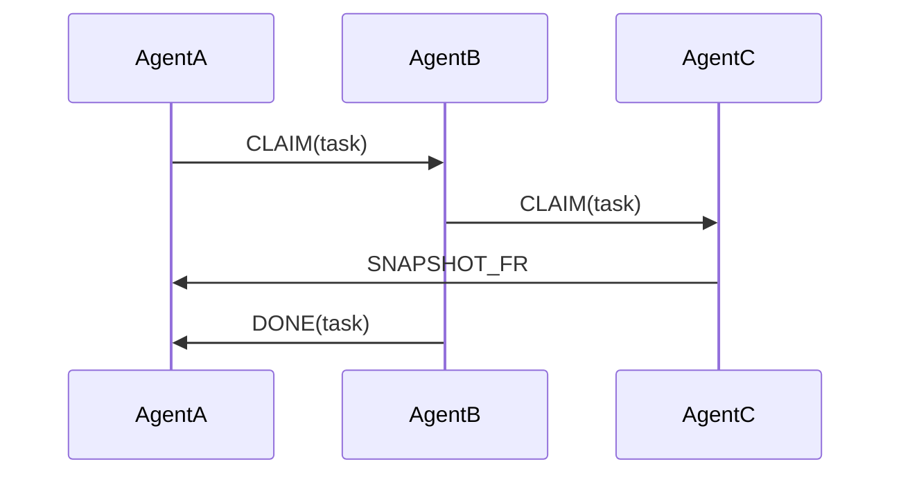
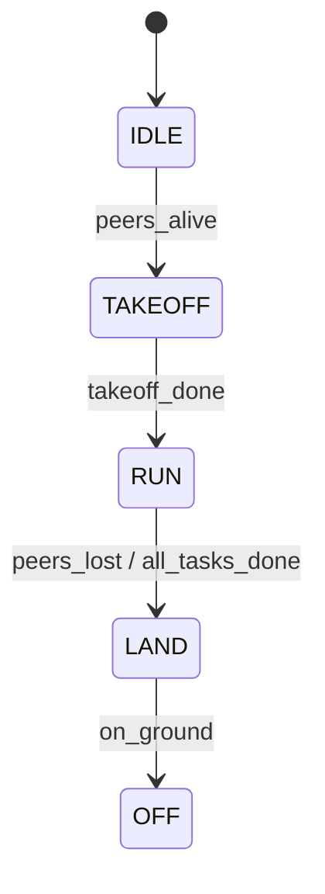

# CBBA (Consensus-Based Bundle Algorithm) — 온보딩 개요

이 문서는 이 예제에 구현된 CBBA의 동작을 새로 들어온 개발자 관점에서 간결하게 설명합니다.

**먼저 읽을 파일**

- `src/cbba_full.c`
- `src/cbba_full.h`
- `src/cbba_state.c`
- `src/p2p_packets.h`
- `src/app_main.c`

## 1. 핵심 아이디어

세 대의 에이전트가 같은 공간상의 task 집합을 공유합니다. 각 에이전트는 다음을 수행합니다.

- 자신의 경로에 task를 삽입했을 때 생기는 증가 비용(insertion cost)을 바탕으로 bid를 계산합니다.
- `bundle`(후보 task 목록)과 `path`(실행 순서)를 유지합니다.
- `bundle`에 든 task에 대해 `CLAIM` 메시지를 전송하고, 다른 에이전트의 `CLAIM`/`DONE`/`SNAPSHOT`을 수신해 자신의 상태를 갱신합니다.

더 높은 bid(동일 bid일 경우 agent id가 낮은 쪽이 우선)가 각 task의 소유권을 결정하고, 소유권이 바뀌면 에이전트는 자신의 bundle을 재구성하여 수렴을 이룹니다.

## 2. 핵심 데이터 구조(평이한 설명)

- `CbbaState` (`src/cbba_full.c` / `src/cbba_full.h`)
  - `tasks[]`: task 좌표와 활성 플래그
  - `winner[t]`, `bid_q[t]`, `ver[t]`: task별 소유자, bid 값, 버전 카운터
  - `bundle[]`, `bundle_len`: 에이전트가 주장하려는 후보 task 목록
  - `path[]`, `path_len`: 삽입 기반의 실행 경로(순서)
  - `exec_task`: 현재 실행 중인 task

- Peer snapshot cache: `PeerSnapshotCache`는 수신된 snapshot fragment를 모아 관찰자(observer)가 전체 수렴 상태를 평가할 수 있게 합니다.

## 3. bid 계산 방식(간단히)

각 후보 task에 대해 현재 `path`에 가장 적합한 삽입 위치를 찾고, 그로 인해 늘어나는 거리(또는 비용) $
\Delta$ 를 계산합니다. 이 증가 비용을 다음과 같은 맵핑으로 정수형 bid로 변환합니다:

$$q = \mathrm{round}(10000 - 1000\cdot\Delta)$$

$\Delta$는 삽입에 따른 거리(단위: m)입니다. $q$가 클수록 우선순위가 높습니다 (삽입 비용이 작을수록 유리).

구현상 `bestInsertionBid()`가 `insertionDeltaCost()`를 호출하고, 그 결과를 `qbid_from_delta()`로 정수로 변환합니다(`src/cbba_full.c`).

## 4. bundle 및 path 관리

- `addBundleTasks()`는 bundle_limit까지 아직 bundle/path에 없는 task들 중 최고 bid인 항목을 골라 `path`의 최적 위치에 삽입합니다.
- `path` 삽입은 길이를 `bundle_limit` 이하로 유지하며, `exec_task = path[0]`이 됩니다.
- 다른 에이전트가 당신의 bundle에 있는 task를 차지하면 `releaseSuffix()`가 충돌 인덱스 이후의 bundle suffix를 잘라내고 재구성합니다.

ASCII diagram (execution flow between agents):

AgentA AgentB AgentC
| | |
|--CLAIM(t1)-->| |
| |--CLAIM(t2)->|
|<--SNAPFR-----| |
| |<--DONE(t2)--|

## 5. 메시지 타입 및 처리 흐름

- `MSG_CLAIM` — 특정 task에 대한 bid를 광고합니다. `Cbba_MakeClaimMsg()`로 생성한 뒤 `p2pCommSendClaim()`으로 전송합니다.
- `MSG_DONE` — 로컬에서 task를 완료했음을 알립니다. `Cbba_MakeDoneMsg()`로 생성됩니다.
- `MSG_SNAPSHOT_FR` — 전체 테이블의 일부 조각(fragment)으로, 관찰자/디버깅 용으로 사용됩니다. `Cbba_MakeSnapshotFragMsg()`로 생성됩니다.

수신 시: `p2p_comm.c`가 이벤트(queue)에 넣고, 메인 루프(`app_main.c`)에서 꺼내어 CBBA 핸들러에 전달합니다.

- `Cbba_HandleClaim()`은 `winner`, `bid_q`, `ver`을 갱신하고, 자신의 bundle에 영향이 있으면 `rebuildBundle()`을 유발할 수 있습니다.
- `Cbba_HandleDone()`은 task를 done으로 표시하고 path/bundle에서 제거합니다.
- `Cbba_HandleSnapshotFrag()`은 observer 지표를 위해 peer 캐시를 갱신합니다.

## 6. 로컬 스텝과 완료 판정

- `Cbba_LocalStep()`는 현재 winner 테이블과 bundle/path의 일관성을 유지합니다. 공간이 있으면 `addBundleTasks()`를 호출하고, `updateLocalFp()`로 fingerprint를 갱신합니다.
- `Cbba_MarkReachedDone()`은 유클리드 거리와 `DONE_RADIUS_M`, `DONE_DWELL_MS`를 이용해 에이전트가 task에 도달·체류했는지 판정하여 done으로 전환합니다.

## 7. 타이밍 & 설정값 (from `app_config.h`)

- `CLAIM_TX_PERIOD_MS`: claim 송신 최소 간격
- `SNAPSHOT_TX_PERIOD_MS`: snapshot 조각 송신 주기
- `DONE_REPEAT_PERIOD_MS`: done 재전송 주기
- `BUNDLE_LIMIT`: 로컬에서 보유할 후보 task 최대 개수
- `TASK_COUNT_RUNTIME`: runtime에서 고려하는 task 개수

이 값들을 조절하면 대역폭 사용량, 수렴 속도, 견고성에 영향을 줍니다.

## 8. 관찰자(observer)와 실행자(executor)

- 코드에는 `cbba_state.*`(observer용 헬퍼)와 `cbba_full.*`(executor) 둘 다 존재합니다. 관찰자는 자신의 뷰(shadow copy)를 패킹해 방송함으로써 전체 수렴 상태를 진단할 수 있게 합니다.

## 9. 디버깅 팁

- 로그에서 `OBS_ONE`, `OBS_DETAIL`, `GUIDE`, `DONE_LOCAL`을 보면 에이전트별 결정과 관찰자 지표를 확인할 수 있습니다.
- task가 경쟁 상태(contested)라면 snapshot 간의 `winner[]`와 `ver[]`를 비교해 보세요.
- 아무도 claim하지 않는 task가 있다면 좌표와 `qbid_from_delta()` 출력(매우 낮은 bid는 큰 삽입 비용을 의미)을 확인하세요.

## 10. 신입을 위한 빠른 읽기 순서

1. `src/cbba_full.h` — API와 타입
2. `src/cbba_full.c` — bidding, path insertion, message 생성
3. `src/p2p_packets.h` — 메시지 와이어 포맷
4. `src/p2p_comm.c` — 수신/큐잉/송신 래퍼
5. `src/app_main.c` — CBBA가 비행 제어와 어떻게 통합되는지

---

아래에는 메시지 흐름과 상태 전이를 Mermaid로 정리한 다이어그램을 추가합니다.

## 메시지 흐름 (Mermaid sequence)

## 상태 전이 (Mermaid state)

ASCII art 보충 (간단):

AgentA AgentB AgentC
| | |
|--CLAIM(t1)-->| |
| |--CLAIM(t2)->|
|<--SNAPFR-----| |
| |<--DONE(t2)--|

원하면 Mermaid 다이어그램을 `ONBOARDING.md`에도 삽입해 드립니다.
