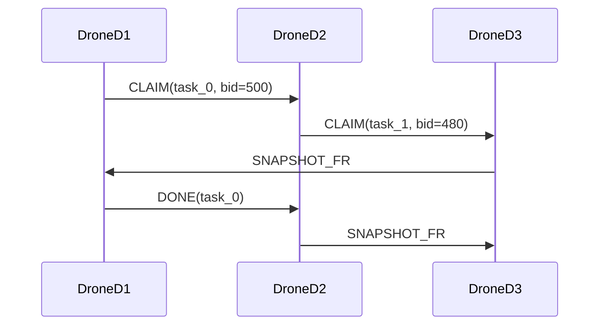
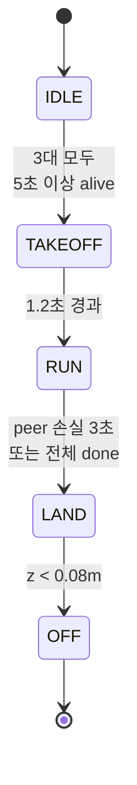

# CBBA (Consensus-Based Bundle Algorithm) — 온보딩 개요

이 문서는 이 예제에 구현된 CBBA의 동작을 새로 들어온 개발자 관점에서 간결하고 실무적으로 설명합니다.

**먼저 읽을 파일**

- `src/cbba_full.c` / `src/cbba_full.h`
- `src/p2p_packets.h`
- `src/p2p_comm.c`
- `src/app_main.c`

## 1. 핵심 아이디어

세 대의 드론이 같은 공간상의 task 집합(7개 waypoint)을 공유합니다. 각 드론은:

1. 자신의 현재 경로에 task를 삽입했을 때 생기는 **증가 비용(insertion cost)**을 바탕으로 **bid**를 계산합니다.
2. `bundle`(후보 task 목록)과 `path`(실행 순서)를 유지합니다.
3. `bundle`에 든 task에 대해 `CLAIM` 메시지를 **주기적으로 전송**합니다.
4. 다른 드론의 `CLAIM`/`DONE`/`SNAPSHOT`을 수신해 **자신의 상태를 갱신**합니다.

**수렴 메커니즘**: 더 높은 bid가 각 task의 소유권을 결정합니다(동일하면 agent id가 낮은 쪽 우선). 소유권이 바뀌면 드론은 자신의 bundle을 **재구성**하여 자동으로 수렴을 이룹니다.

## 2. 핵심 데이터 구조

### CbbaState (src/cbba_full.c / src/cbba_full.h)

```cpp
typedef struct
{
  uint8_t agent_id;              // 1, 2, 3 (D1, D2, D3)
  CbbaTask tasks[TASK_MAX];      // task[].pos, task[].active

  uint8_t winner[TASK_MAX];      // 각 task의 현재 소유자
  int16_t bid_q[TASK_MAX];       // 각 task의 bid 값
  uint8_t ver[TASK_MAX];         // 각 task의 버전 카운터
  uint8_t done[TASK_MAX];        // 각 task의 완료 여부

  uint8_t bundle[TASK_MAX];      // 내가 주장할 후보 task 목록
  uint8_t bundle_len;            // bundle 길이 (max: BUNDLE_LIMIT=3)
  uint8_t path[TASK_MAX];        // 실행 순서 (insertion-based)
  uint8_t path_len;

  uint8_t exec_task;             // 현재 실행 중인 task (path[0])
  CbbaVec2 self_pos;             // 현재 위치
} CbbaState;
```

### PeerSnapshotCache

각 드론이 수신한 **snapshot fragment**를 모아 peer들의 현재 상태(winner table, done 상황)를 추적합니다.

## 3. Bid 계산 방식

각 후보 task에 대해:

1. **최적 삽입 위치** 찾기: 현재 `path`에 task를 삽입할 때 total distance가 최소인 위치 계산
2. **증가 비용 계산**: 삽입 전후의 거리 차이 $\Delta$ (단위: m) 계산
3. **Bid로 변환**:

$$q = \mathrm{round}(10000 - 1000 \times \Delta)$$

**규칙**: $q$가 클수록 우선순위 높음 (삽입 비용이 작을수록 유리).

구현: `bestInsertionBid()` → `insertionDeltaCost()` → `qbid_from_delta()`

## 4. Bundle과 Path 관리

| 함수               | 역할                                                                   |
| ------------------ | ---------------------------------------------------------------------- |
| `addBundleTasks()` | bundle_limit까지 최고 bid인 task들을 선택해 path에 최적 위치 삽입      |
| `releaseSuffix()`  | 다른 드론이 당신의 bundle 항목을 차지하면 충돌 인덱스 이후 suffix 제거 |
| `Cbba_LocalStep()` | winner table과 bundle/path 일관성 유지, fingerprint 갱신               |

**흐름**:

```
addBundleTasks() → 최고 bid task 선택
                → path[best_idx]에 삽입
                → exec_task = path[0]
```

## 5. 메시지 타입 및 처리

| 메시지            | 용도                  | 생성 함수                    | 송신 함수                   |
| ----------------- | --------------------- | ---------------------------- | --------------------------- |
| `MSG_BEACON`      | 생존 신호 (주기 20Hz) | —                            | `p2pCommSendBeacon()`       |
| `MSG_CLAIM`       | Task bid 광고         | `Cbba_MakeClaimMsg()`        | `p2pCommSendClaim()`        |
| `MSG_DONE`        | Task 완료 알림        | `Cbba_MakeDoneMsg()`         | `p2pCommSendDone()`         |
| `MSG_SNAPSHOT_FR` | 상태 스냅샷 조각      | `Cbba_MakeSnapshotFragMsg()` | `p2pCommSendSnapshotFrag()` |

### 수신 처리 흐름

```
[P2P callback (p2p_comm.c)]
  → 중복 제거 (src, type, seq)
  → event queue에 push

[Main loop (app_main.c)]
  → queue에서 꺼냄
  → Cbba_HandleClaim() / HandleDone() / HandleSnapshotFrag()
  → winner/bid_q/ver 갱신, rebuildBundle() 가능
```

## 6. 로컬 스텝과 완료 판정

### Cbba_LocalStep()

- bundle과 현재 winner table의 불일치 해결
- 공간이 있으면 새 task 추가

### Cbba_MarkReachedDone()

- **거리 기반**: 유클리드 거리 < `DONE_RADIUS_M` (0.18m)
- **체류 시간**: `DONE_DWELL_MS` (250ms) 동안 근처에 있어야 함
- 조건 만족 → task done으로 전환 → bundle/path에서 제거

## 7. 타이밍 및 설정값 (app_config.h)

| 설정                    | 값  | 의미                         |
| ----------------------- | --- | ---------------------------- |
| `CLAIM_TX_PERIOD_MS`    | 150 | claim 송신 최소 간격         |
| `SNAPSHOT_TX_PERIOD_MS` | 250 | snapshot 송신 주기           |
| `DONE_REPEAT_PERIOD_MS` | 150 | done 재전송 주기             |
| `BEACON_TX_HZ`          | 20  | beacon 송신 주파수           |
| `BUNDLE_LIMIT`          | 3   | 로컬 bundle 최대 크기        |
| `TASK_COUNT_RUNTIME`    | 7   | runtime에서 고려하는 task 수 |

**조정 영향**: 대역폭 ↔ 수렴 속도 ↔ 견고성

## 8. 메시지 흐름 다이어그램



## 9. 상태 전이 다이어그램



## 10. 관찰자(Observer) 개념

`cbba_state.*` 모듈은 **observer 모드**를 제공:

- 자신의 winner/bid/done 상태를 **shadow copy**로 유지
- **snapshot fragment**를 주기적으로 방송
- 다른 드론의 snapshot을 받아 **전체 수렴 상태 진단** (observer metrics)
  - `all_known`: 모든 드론의 상태를 알고 있는가?
  - `winner_conv`: winner table이 수렴했는가?
  - `contested_tasks`: 아직 경쟁 중인 task 개수

## 11. 디버깅 팁

### 로그 보기

- `OBS_ONE`: 각 시점의 observer 요약
- `OBS_DETAIL`: 상세 지표 (contested_count, fingerprint 등)
- `GUIDE`: 비행 유도 (target, error, velocity)
- `DONE_LOCAL`: 로컬 완료 이벤트

### 문제 해결

| 증상                      | 확인 사항                                                       |
| ------------------------- | --------------------------------------------------------------- |
| Task가 계속 contested     | `winner[]`, `bid_q[]`, `ver[]` 값 비교                          |
| Task를 아무도 claim 안 함 | 좌표가 맞는지, `qbid_from_delta()` 출력 (음수면 삽입 비용 크다) |
| 수렴이 느림               | `CLAIM_TX_PERIOD_MS`, `SNAPSHOT_TX_PERIOD_MS` 줄이기            |
| Packet 손실               | `p2pCommGetDropCount()` 확인, RX 큐 크기 (`RX_QUEUE_N`) 늘리기  |

## 12. 신입 빠른 읽기 순서

1. **이 문서** (전체 그림 파악)
2. `src/cbba_full.h` (API와 데이터 타입)
3. `src/cbba_full.c` — 특히:
   - `Cbba_Init()`: 초기화
   - `addBundleTasks()`: bid 계산 및 bundle 구성
   - `Cbba_HandleClaim()`: 수신 claim 처리
   - `Cbba_MarkReachedDone()`: 완료 판정
4. `src/p2p_packets.h` (메시지 구조)
5. `src/app_main.c` — 특히 RUN 상태 루프

## 13. 한 줄 요약

**CBBA는 각 드론이 로컬에서 insertion cost 기반 bid를 계산하고, P2P로 bid/done을 주고받아 자동으로 task를 나누고 모순 없이 수렴하는 분산 할당 알고리즘입니다.**
