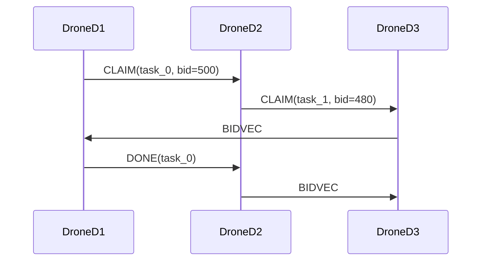
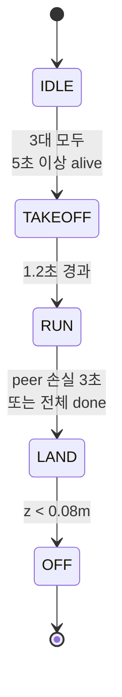

# CBBA 기반 분산 Task 할당 — 온보딩 개요

이 문서는 이 예제에 구현된 분산 task 할당 알고리즘의 동작을 새로 들어온 개발자 관점에서 간결하고 실무적으로 설명합니다.

> **원본 논문과의 관계**: 이 구현은 CBBA(Choi, Brunet, How 2009)의 insertion-cost 기반 입찰과 bundle/path 관리 구조에서 영감을 받았으나, 임베디드 P2P 환경에 맞게 단순화/변형한 자체 구현입니다. 주요 차이점:
> - 논문의 timestamp 벡터(s_i) 기반 Table 1 충돌 해결 대신, **version 카운터(`ver[]`) 기반 비교**를 사용
> - 논문의 전체 상태 교환 대신, **개별 CLAIM + BIDVEC 브로드캐스트** 방식으로 점진적 동기화
> - 논문의 DMG(Diminishing Marginal Gain) 보장 대신, **실시간 bid 갱신과 reservation lease** 메커니즘 적용
> - **done_mask 전파**, **peer 충돌 회피(APF)**, **동기 이륙** 등 실제 비행에 필요한 기능 추가

**먼저 읽을 파일**

- `src/cbba_full.c` / `src/cbba_full.h`
- `src/p2p_packets.h`
- `src/p2p_comm.c`
- `src/app_main.c`

## 1. 핵심 아이디어

세 대의 드론이 같은 공간상의 task 집합을 공유합니다. 각 드론은:

1. 자신의 현재 경로에 task를 삽입했을 때 생기는 **증가 비용(insertion cost)**을 바탕으로 **bid**를 계산합니다.
2. `bundle`(후보 task 목록)과 `path`(실행 순서)를 유지합니다.
3. `bundle`에 든 task에 대해 `CLAIM` 메시지를 **주기적으로 전송**합니다.
4. 다른 드론의 `CLAIM`/`DONE`/`BIDVEC`을 수신해 **자신의 상태를 갱신**합니다.

**수렴 메커니즘**: 더 높은 bid가 각 task의 소유권을 결정합니다(동일하면 agent id가 낮은 쪽 우선). 소유권이 바뀌면 드론은 자신의 bundle을 **재구성**하여 자동으로 수렴을 이룹니다.

## 2. 핵심 데이터 구조

### CbbaState (src/cbba_full.c / src/cbba_full.h)

```cpp
typedef struct
{
  uint8_t agent_id;              // 1, 2, 3 (D1, D2, D3)
  CbbaTask tasks[TASK_MAX];      // task[].pos, task[].active

  uint8_t winner[TASK_MAX];      // 각 task의 현재 소유자
  int16_t bid_q[TASK_MAX];       // 각 task의 bid 값
  uint8_t ver[TASK_MAX];         // 각 task의 버전 카운터
  uint8_t done[TASK_MAX];        // 각 task의 완료 여부

  uint8_t bundle[TASK_MAX];      // 내가 주장할 후보 task 목록
  uint8_t bundle_len;            // bundle 길이 (max: BUNDLE_LIMIT)
  uint8_t path[TASK_MAX];        // 실행 순서 (insertion-based)
  uint8_t path_len;

  uint8_t exec_task;             // 현재 실행 중인 task (path[0])
  CbbaVec2 self_pos;             // 현재 위치
} CbbaState;
```

### PeerMissionCache

각 드론이 수신한 **claim/done/bidvec** 메시지를 통해 peer들의 현재 상태(winner table, bid, done 상황)를 추적합니다.

## 3. Bid 계산 방식

각 후보 task에 대해:

1. **최적 삽입 위치** 찾기: 현재 `path`에 task를 삽입할 때 total distance가 최소인 위치 계산
2. **증가 비용 계산**: 삽입 전후의 거리 차이 $\Delta$ (단위: m) 계산
3. **Bid로 변환**:

$$q = \mathrm{round}(10000 - 1000 \times \Delta)$$

**규칙**: $q$가 클수록 우선순위 높음 (삽입 비용이 작을수록 유리).

구현: `bestInsertionBid()` → `insertionDeltaCost()` → `qbid_from_delta()`

## 4. Bundle과 Path 관리

| 함수               | 역할                                                                   |
| ------------------ | ---------------------------------------------------------------------- |
| `addBundleTasks()` | bundle_limit까지 최고 bid인 task들을 선택해 path에 최적 위치 삽입      |
| `releaseSuffix()`  | 다른 드론이 당신의 bundle 항목을 차지하면 충돌 인덱스 이후 suffix 제거 |
| `Cbba_LocalStep()` | winner table과 bundle/path 일관성 유지, fingerprint 갱신               |

**흐름**:

```
addBundleTasks() → 최고 bid task 선택
                → path[best_idx]에 삽입
                → exec_task = path[0]
```

## 5. 메시지 타입 및 처리

| 메시지        | 용도                    | 생성 함수               | 송신 함수              |
| ------------- | ----------------------- | ----------------------- | ---------------------- |
| `MSG_BEACON`  | 위치/상태 브로드캐스트  | —                       | `p2pCommSendBeacon()`  |
| `MSG_CLAIM`   | Task bid 광고           | `Cbba_MakeClaimMsg()`   | `p2pCommSendClaim()`   |
| `MSG_DONE`    | Task 완료 알림          | `Cbba_MakeDoneMsg()`    | `p2pCommSendDone()`    |
| `MSG_BIDVEC`  | 전체 bid 벡터 브로드캐스트 | `Cbba_MakeBidVecMsg()` | `p2pCommSendBidVec()`  |

### 수신 처리 흐름

```
[P2P callback (p2p_comm.c)]
  → 중복 제거 (src, type, seq)
  → event queue에 push

[Main loop (app_main.c)]
  → queue에서 꺼냄
  → Cbba_HandleClaim() / HandleDone() / HandleBidVec()
  → winner/bid_q/ver 갱신, bundle 재구성 가능
```

## 6. 로컬 스텝과 완료 판정

### Cbba_LocalStep()

- bundle과 현재 winner table의 불일치 해결
- 공간이 있으면 새 task 추가

### Cbba_MarkReachedDone()

- **거리 기반**: 유클리드 거리 < `DONE_RADIUS_M` (0.18m)
- **체류 시간**: `DONE_DWELL_MS` (250ms) 동안 근처에 있어야 함
- 조건 만족 → task done으로 전환 → bundle/path에서 제거

## 7. 타이밍 및 설정값 (app_config.h)

| 설정                    | 기본값 | 의미                            |
| ----------------------- | ------ | ------------------------------- |
| `CLAIM_TX_PERIOD_MS`    | 100    | claim 송신 최소 간격            |
| `BIDVEC_TX_PERIOD_MS`   | 100    | bid 벡터 브로드캐스트 주기      |
| `DONE_REPEAT_PERIOD_MS` | 150    | done 재전송 주기                |
| `BEACON_TX_HZ`          | 10     | beacon 송신 주파수              |
| `BUNDLE_LIMIT`          | 1      | 로컬 bundle 최대 크기           |
| `TASK_COUNT_RUNTIME`    | 3      | runtime에서 고려하는 task 수    |

**조정 영향**: 대역폭 ↔ 수렴 속도 ↔ 견고성

## 8. 메시지 흐름 다이어그램


```mermaid
sequenceDiagram
    participant D1 as DroneD1
    participant D2 as DroneD2
    participant D3 as DroneD3

    D1->>D2: CLAIM(task_0, bid=500)
    D2->>D3: CLAIM(task_1, bid=480)
    D3->>D1: BIDVEC
    D1->>D2: DONE(task_0)
    D2->>D3: BIDVEC
```

## 9. 상태 전이 다이어그램


```mermaid
stateDiagram-v2
    [*] --> IDLE
    IDLE --> TAKEOFF: 3대 모두<br/>5초 이상 alive
    TAKEOFF --> RUN: 1.2초 경과
    RUN --> LAND: peer 손실 3초<br/>또는 전체 done
    LAND --> OFF: z < 0.08m
    OFF --> [*]
```

## 10. Peer 상태 관찰

`PeerMissionCache` 구조체를 통해 peer들의 현재 상태를 추적합니다:

- `MSG_BIDVEC`를 수신하면 peer의 전체 bid 벡터, done_mask, exec_task을 캐시에 저장
- `MSG_CLAIM`/`MSG_DONE` 수신 시에도 해당 필드 갱신
- `Cbba_GetGlobalDoneCount()`로 자신 + peer들의 done 합산 확인
- `Cbba_AbsorbGlobalDoneMask()`로 peer가 보고한 done 상태를 자신의 상태에 흡수

## 11. 디버깅 팁

### 로그 보기

- `OBS_ONE`: 각 시점의 observer 요약
- `OBS_DETAIL`: 상세 지표 (contested_count, fingerprint 등)
- `GUIDE`: 비행 유도 (target, error, velocity)
- `DONE_LOCAL`: 로컬 완료 이벤트

### 문제 해결

| 증상                      | 확인 사항                                                       |
| ------------------------- | --------------------------------------------------------------- |
| Task가 계속 contested     | `winner[]`, `bid_q[]`, `ver[]` 값 비교, `peer_bid_q[][]` 확인   |
| Task를 아무도 claim 안 함 | 좌표가 맞는지, `qbid_from_delta()` 출력 (음수면 삽입 비용 크다) |
| 수렴이 느림               | `CLAIM_TX_PERIOD_MS`, `SNAPSHOT_TX_PERIOD_MS` 줄이기            |
| Packet 손실               | `p2pCommGetDropCount()` 확인, RX 큐 크기 (`RX_QUEUE_N`) 늘리기  |

## 12. 신입 빠른 읽기 순서

1. **이 문서** (전체 그림 파악)
2. `src/cbba_full.h` (API와 데이터 타입)
3. `src/cbba_full.c` — 특히:
   - `Cbba_Init()`: 초기화
   - `addBundleTasks()`: bid 계산 및 bundle 구성
   - `Cbba_HandleClaim()`: 수신 claim 처리
   - `Cbba_MarkReachedDone()`: 완료 판정
4. `src/p2p_packets.h` (메시지 구조)
5. `src/app_main.c` — 특히 RUN 상태 루프

## 13. 한 줄 요약

**이 시스템은 CBBA에서 영감을 받아, 각 드론이 로컬에서 insertion cost 기반 bid를 계산하고, P2P로 claim/bidvec/done을 주고받아 자동으로 task를 나누고 수렴하는 분산 할당 알고리즘입니다.**
