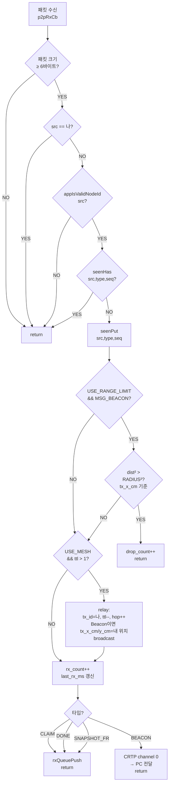

# Mesh Network 구조 설명

이 문서는 `p2p_comm.c` 를 중심으로 mesh flooding이 어떻게 동작하는지를 신입 개발자 시점으로 설명합니다.

---

## 목차

1. [전체 구조 한눈에 보기](#1-전체-구조-한눈에-보기)
2. [패킷 헤더 구조](#2-패킷-헤더-구조)
3. [Flooding 동작 — TTL과 hop](#3-flooding-동작--ttl과-hop)
4. [중복 제거 — seen 캐시](#4-중복-제거--seen-캐시)
5. [수신 큐 관리 — rx_q](#5-수신-큐-관리--rx_q)
6. [거리 제한 — USE_RANGE_LIMIT](#6-거리-제한--use_range_limit)
7. [CBBA 패킷의 거리 정보 부재 문제](#7-cbba-패킷의-거리-정보-부재-문제)
8. [수신 콜백 전체 흐름](#8-수신-콜백-전체-흐름)
9. [설정 파라미터 정리](#9-설정-파라미터-정리)
10. [자주 헷갈리는 지점](#10-자주-헷갈리는-지점)

---

## 1. 전체 구조 한눈에 보기

3대의 드론(D1, D2, D3)이 모두 서로 직접 통신할 수 없는 경우를 가정합니다.  
D1과 D3는 거리가 멀어서 직접 통신이 안 되고, D2가 두 드론 사이에서 중계(relay)합니다.

```
  D1  ←──────────────────────────→  D3
        통신 불가 (거리 초과)

  D1  ←──────→  D2  ←──────→  D3
       relay          relay
```

이 구조를 **flooding** 방식으로 구현합니다. 각 노드는 수신한 패킷의 TTL이 남아 있으면 즉시 재브로드캐스트하고, seen 캐시로 중복 수신을 막습니다.

### 레이어 구조

```
 app_main.c
  │  p2pCommPollEvent()       ← CBBA 이벤트 소비
  │  p2pCommSendBeacon/Claim/Done/Snapshot()
  ▼
 p2p_comm.c
  │  p2pRxCb()                ← nRF 라디오 수신 콜백
  │  sendPacket()             ← nRF 브로드캐스트 송신
  ▼
 radiolink.c (펌웨어 내부)
  │  radiolinkSendP2PPacketBroadcast()
  ▼
 nRF51822 (P2P 전용 ESB 브로드캐스트)
```

---

## 2. 패킷 헤더 구조

모든 패킷 타입(Beacon, Claim, Done, Snapshot)은 **공통 6바이트 헤더**를 공유합니다.

```
byte offset:  [0]     [1]      [2]     [3]    [4]   [5]
              type  src_id   tx_id    seq    ttl   hop
```

| 필드 | 설명 |
|------|------|
| `type` | 메시지 종류 (1=Beacon, 2=Claim, 3=Done, 4=SnapshotFrag) |
| `src_id` | **원본 발신자** ID. 절대 바뀌지 않음 |
| `tx_id` | **마지막 송신자** ID. 직접 송신 시 = src_id, relay 시 = 중계 노드 ID |
| `seq` | 발신자 기준 시퀀스 번호. 중복 제거 키로 사용 |
| `ttl` | 남은 전파 횟수. 송신 시 `TTL_MAX`로 초기화, relay할 때마다 -1 |
| `hop` | 현재까지 거친 중계 횟수. 송신 시 0, relay할 때마다 +1 |

### Beacon 패킷 전체 구조 (18바이트)

```c
typedef struct __attribute__((packed)) {
  uint8_t  type;      // [0]
  uint8_t  src_id;    // [1]
  uint8_t  tx_id;     // [2]
  uint8_t  seq;       // [3]
  uint8_t  ttl;       // [4]
  uint8_t  hop;       // [5]
  uint16_t t_ms;      // [6-7]   현재 시각 (ms, 16-bit 롤오버)
  int16_t  x_cm;      // [8-9]   원본 src 세계 좌표 x (cm)
  int16_t  y_cm;      // [10-11] 원본 src 세계 좌표 y (cm)
  int16_t  z_cm;      // [12-13] 원본 src 고도 (cm)
  int16_t  tx_x_cm;   // [14-15] 마지막 송신자(tx) 세계 좌표 x (cm)
  int16_t  tx_y_cm;   // [16-17] 마지막 송신자(tx) 세계 좌표 y (cm)
} msg_beacon_t;
```

- `x_cm/y_cm/z_cm` : **원본 발신자(src)** 의 위치. relay를 거쳐도 변하지 않음.
- `tx_x_cm/tx_y_cm` : **마지막으로 이 패킷을 실제로 쏜 드론(tx)** 의 위치. 직접 송신 시 src와 동일, relay 시 중계 노드가 자신의 위치로 덮어씀.

거리 제한 체크는 항상 `tx_x_cm/tx_y_cm`를 사용합니다 — 피어 위치 캐시 불필요.

CBBA 패킷(Claim, Done, Snapshot)은 공통 헤더 이후 위치 정보 없이 할당 상태 데이터만 담습니다.

---

## 3. Flooding 동작 — TTL과 hop

### 핵심 규칙

- **TTL > 1** 이면 relay(재브로드캐스트)한다.
- **TTL = 1** 이면 나만 소비하고 더 이상 전파하지 않는다.

### relay 시 수행하는 수정

```c
((uint8_t*)g_relay_pkt.data)[2] = g_my_id;  // tx_id ← 나
((uint8_t*)g_relay_pkt.data)[4]--;           // ttl--
((uint8_t*)g_relay_pkt.data)[5]++;           // hop++
// Beacon이면 tx 위치도 갱신
if (type == MSG_BEACON) {
    rb->tx_x_cm = (int16_t)(g_my_x_m * 100.0f);
    rb->tx_y_cm = (int16_t)(g_my_y_m * 100.0f);
}
```

`src_id`, `seq`, `x_cm/y_cm/z_cm`(원본 src 위치)는 절대 바꾸지 않습니다.  
`src_id`와 `seq`는 중복 제거 키이고, `x_cm/y_cm`는 원본 발신자의 위치를 보존합니다.

### TTL_MAX = 2 기준 3대 시나리오

```
D1 송신 (ttl=2, hop=0, tx=D1)
  │
  ├──▶ D2 수신 (ttl=2, hop=0)
  │      seen에 없음 → seenPut(D1, BEACON, seq)
  │      ttl(2) > 1 → relay 전송 (ttl=1, hop=1, tx=D2)
  │        │
  │        └──▶ D3 수신 (ttl=1, hop=1, tx=D2)
  │               seen에 없음 → seenPut
  │               ttl(1) ≯ 1 → relay 안 함 ✓
  │
  └──▶ D3 직접 수신 (in range이면)
         seenHas(D1, BEACON, seq) = true → 즉시 drop ✓  (D2 relay 패킷보다 먼저 오든 나중에 오든)
```

TTL_MAX를 1 올릴 때마다 최대 relay 깊이가 1 늘어납니다.

| TTL_MAX | 최대 hop | 커버 범위 |
|---------|----------|-----------|
| 1 | 0 (direct only) | 직접 닿는 노드만 |
| 2 | 1 | 1-hop relay: 3대 직선 배치 커버 |
| 3 | 2 | 2-hop relay: 더 긴 체인 커버 |

---

## 4. 중복 제거 — seen 캐시

### 구조

```c
typedef struct {
  uint8_t src_id;
  uint8_t type;
  uint8_t seq;
} seen_t;

static seen_t g_seen[SEEN_N];   // SEEN_N = 128
static uint8_t g_seen_wr = 0u;  // 링버퍼 쓰기 포인터
```

### 동작 방식

`(src_id, type, seq)` 3-tuple을 키로 최근 128개 패킷을 링버퍼에 기록합니다.  
같은 키가 들어오면 즉시 drop합니다.

```
seenHas(src, type, seq)?
  YES → drop (중복)
  NO  → seenPut(src, type, seq) → 이후 처리 진행
```

### 링버퍼 특성과 주의점

```
  [0][1][2]...[127]  ← 128개 슬롯
        ↑
     g_seen_wr (여기에 다음 기록)
```

- 오래된 항목부터 덮어씁니다 (LRU 아닌 FIFO 방식).
- SEEN_N=128이 너무 작으면 오래된 항목이 덮어써져서 같은 패킷을 두 번 처리할 수 있습니다.
- **seenPut은 range check 이전에 호출됩니다.** 범위 밖으로 드랍된 패킷도 seen에 기록됩니다. 이는 의도된 설계입니다 — 같은 패킷이 다른 경로로 또 들어와도 relay storm 없이 버립니다.

### seen이 막아주는 loop 예시

```
D1 송신
  D2 relay → D3 수신 ✓
  D3 relay → D2 수신 → seenHas = true → drop ✓  (D2가 자신이 중계한 패킷을 다시 받음)
  D2 relay → D1 수신 → src == g_my_id → drop ✓   (자기 패킷은 src 체크로 먼저 필터)
```

---

## 5. 수신 큐 관리 — rx_q

Beacon은 CRTP로 PC에 바로 전달하고 큐에 넣지 않습니다.  
CBBA 패킷(Claim, Done, Snapshot)만 `g_rx_q`에 쌓아 `app_main.c`가 소비합니다.

### 구조

```c
static app_rx_event_t g_rx_q[RX_QUEUE_N];   // RX_QUEUE_N = 24
static uint8_t g_rx_head = 0u;
static uint8_t g_rx_tail = 0u;
static uint8_t g_rx_count_q = 0u;
```

### 링버퍼 Push / Poll

```
Push (p2pRxCb 안):                 Poll (app_main.c 루프):
  count >= RX_QUEUE_N?               count == 0?
    → drop_count++, return             → return false
  g_rx_q[tail] = event               out_evt = g_rx_q[head]
  tail = (tail+1) % N                head = (head+1) % N
  count++                            count--
```

### 처리 흐름 (app_main.c)

```
while (p2pCommPollEvent(&ev)) {
  CLAIM      → Cbba_HandleClaim()
  DONE       → Cbba_HandleDone()
  SNAPSHOT   → Cbba_HandleSnapshotFrag()
               + updatePeerCache()
}
```

큐가 꽉 찼을 때 drop된 패킷은 `g_drop_count`에 기록되고 `p2pCommGetDropCount()`로 확인할 수 있습니다.

---

## 6. 거리 제한 — USE_RANGE_LIMIT

`USE_RANGE_LIMIT = 1`로 컴파일하면 통신 반경 밖에서 온 패킷을 소프트웨어적으로 드랍합니다.  
실제 물리적 범위를 시뮬레이션하는 용도입니다.

### 판정 기준: 패킷의 `tx_x_cm/tx_y_cm`와 나 사이의 거리

원본 발신자(src)와의 거리가 아니라, **마지막으로 이 패킷을 실제로 쏜 드론(tx)** 과의 거리를 봅니다.  
`tx_x_cm/tx_y_cm` 필드가 항상 tx의 현재 위치를 담고 있으므로 별도 캐시 없이 패킷에서 바로 읽습니다.

```
hop=0 (직접 수신):  tx_x_cm == x_cm (src가 곧 tx)
hop>0 (relay 수신): relay 노드가 자신의 위치로 tx_x_cm/tx_y_cm을 덮어씀
```

수식:

```
dist² = (tx_x_cm*0.01 - my_x)² + (tx_y_cm*0.01 - my_y)²

dist² > COMM_RADIUS_M²  →  drop
```

sqrt 없이 제곱 비교로 처리하여 연산량을 최소화합니다.

### 예시: 범위 제한이 있는 3대 직선 배치

```
D1(0m) ←──1.2m──→ D2(1.2m) ←──1.2m──→ D3(2.4m)
          COMM_RADIUS_M = 1.5m

D3가 D1의 beacon relay를 D2로부터 수신할 때:
  hop=1, tx_id=D2, tx_x_cm = D2 위치(1.2m)
  dist = |2.4 - 1.2| = 1.2m < 1.5m → 통과 ✓

D1과 D3가 직접 통신을 시도한다면 (hop=0):
  tx_x_cm = D1 위치(0m)
  dist = |2.4 - 0.0| = 2.4m > 1.5m → drop ✓
```

---

## 7. CBBA 패킷의 거리 체크 부재

### 문제

Claim, Done, SnapshotFrag 패킷에는 위치 데이터가 없습니다.  
공통 헤더 6바이트만 있고, 이후는 할당 상태 데이터입니다.

```c
typedef struct __attribute__((packed)) {
  uint8_t type;
  uint8_t src_id;
  uint8_t tx_id;
  uint8_t seq;
  uint8_t ttl;
  uint8_t hop;
  uint8_t task_id;   // ← 위치 정보 없음
  int16_t bid_q;
  ...
} msg_claim_t;
```

### 현재 설계: CBBA 패킷은 거리 체크 없이 항상 통과

`USE_RANGE_LIMIT` 블록이 `MSG_BEACON` 타입에만 적용됩니다.

```c
#if USE_RANGE_LIMIT
  if ((type == MSG_BEACON) && ...)   // ← MSG_CLAIM/DONE/SNAPSHOT 해당 없음
  { ... }
#endif
```

### 이 설계가 합리적인 이유

1. **CBBA의 정확성이 우선**: 거리 제한으로 CBBA 메시지를 드랍하면 task 할당이 수렴하지 못할 수 있습니다.
2. **Beacon이 게이트키퍼 역할**: `g_last_rx_ms`는 Beacon을 기반으로 갱신됩니다. Beacon이 거리 체크를 통과하지 못한 노드는 `peerAliveId()` 판정에서 dead로 분류되어 CBBA에서 자연스럽게 배제됩니다.
3. **relay로 도달하는 CBBA는 이미 가까운 노드를 경유**: Beacon이 relay를 통해 도달했다면, CBBA도 같은 경로를 사용합니다. tx_id 드론이 내 범위 안에 있다는 사실은 Beacon 체크에서 이미 확인됩니다.

정리하면:

```
Beacon 거리 체크 통과 여부 → peerAlive 판정
                           → CBBA 참여 여부 결정

CBBA 패킷 → 거리 체크 없이 통과
            (peerAlive에서 걸러진 노드의 메시지는 CBBA 로직에서 무시됨)
```

---

## 8. 수신 콜백 전체 흐름

`p2pRxCb()`가 패킷을 수신할 때 거치는 단계를 순서도로 표현합니다.



---

## 9. 설정 파라미터 정리

`app_config.h`의 mesh 관련 파라미터입니다.

| 파라미터 | 기본값 | 설명 |
|----------|--------|------|
| `USE_MESH` | `0u` | 1로 설정 시 flooding relay 활성화 |
| `TTL_MAX` | `2u` | 패킷 최초 송신 시 설정되는 TTL. 1=direct only, N=(N-1)hop relay |
| `USE_RANGE_LIMIT` | `0u` | 1로 설정 시 거리 기반 beacon 필터링 활성화 |
| `COMM_RADIUS_M` | `1.00f` | 통신 반경(m). `USE_RANGE_LIMIT=1`일 때만 유효 |
| `SEEN_N` | `128u` | 중복 제거 링버퍼 크기 |
| `RX_QUEUE_N` | `24u` | CBBA 이벤트 수신 큐 크기 |
| `BEACON_TX_HZ` | `20u` | 초당 beacon 송신 횟수 |

### 조합별 동작 요약

| USE_MESH | USE_RANGE_LIMIT | 동작 |
|----------|-----------------|------|
| 0 | 0 | 직접 연결 노드만, 거리 제한 없음 |
| 0 | 1 | 직접 연결 노드만, beacon 거리 필터링 |
| 1 | 0 | flooding relay, 거리 제한 없음 |
| 1 | 1 | flooding relay + 각 홉마다 거리 필터링 |

---

## 10. 자주 헷갈리는 지점

### Q. relay 패킷은 왜 g_last_rx_ms를 갱신하나요?

`peerAliveId()`는 `g_last_rx_ms[appNodeIndexFromId(src)]`를 기반으로 판단합니다.  
relay로 도착한 패킷도 `src_id`가 원본 드론 ID이므로, 해당 드론의 생존 시각이 갱신됩니다.  
이 덕분에 D1과 D3가 직접 통신이 안 되어도 D2를 통해 서로의 존재를 확인할 수 있습니다.

### Q. seenPut을 range check 전에 하는 이유가 뭔가요?

의도된 설계입니다. 거리 밖이라 드랍한 패킷도 seen에 기록하면, 같은 패킷이 다른 경로로 또 들어올 때 불필요한 처리(relay 포함)를 방지할 수 있습니다.

만약 range check 후에 seenPut을 하면:
```
[패킷 도착] → [range 밖으로 drop] → seenPut 안 됨
→ 같은 패킷이 다른 경로로 또 도착 → 또 처리 → 무한 반복 가능
```

### Q. TTL_MAX=2인데 왜 relay를 한 번만 하나요?

TTL=2로 시작하면 첫 수신 노드가 TTL-1=1로 relay합니다.  
그 다음 노드는 TTL=1을 수신하는데, 조건이 `ttl > 1`이므로 relay하지 않습니다.  
결과적으로 최대 1번의 relay가 발생합니다.

TTL_MAX=N이면 최대 N-1번 relay가 발생합니다.

### Q. CRTP는 mesh에 참여하지 않나요?

CRTP는 드론↔PC 간 유선/무선 연결이고, P2P는 드론↔드론 간 nRF ESB 브로드캐스트입니다.  
완전히 별개의 채널입니다. `p2pRxCb` 안의 CRTP 전송은 "수신한 beacon을 PC에 알려주는" 단방향 보고 용도입니다. PC에서 드론으로 mesh에 참여하는 구조는 없습니다.
